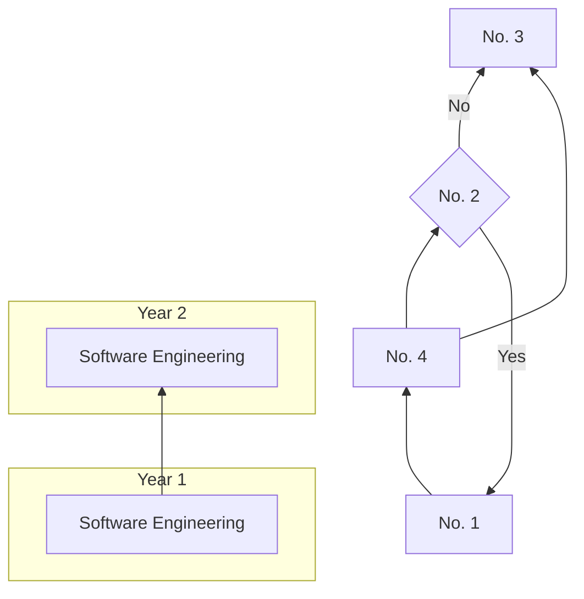
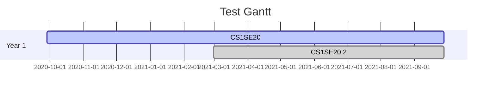

# 29012845 Assignment 2: Models
Module Code: CS1SE20

Assignment report Title: Models Report

Student Number: 29012845

Date:

Actual hrs spent for the assignment:

Assignment evaluation (3 key points): 

# Abstract

## Introduction

## Background

## Work Breakdown Structure

## Gantt for My Studies

## CV

## Reflection
