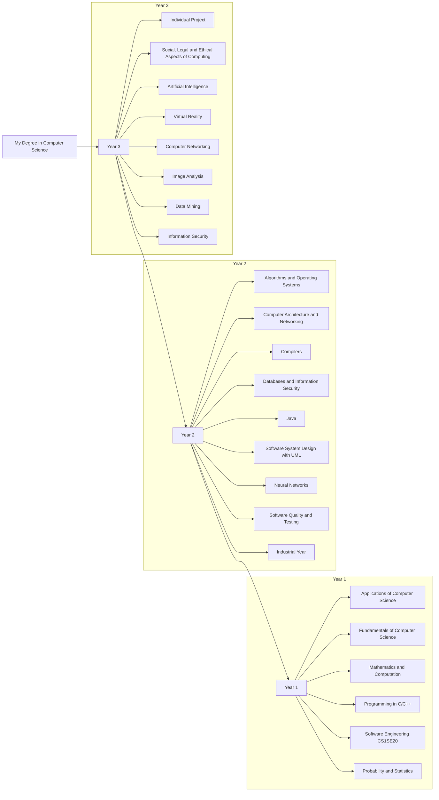
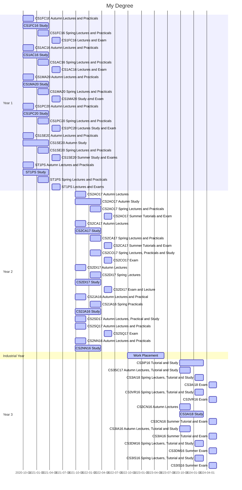

# 29012845 Assignment 2: Models
Module Code: CS1SE20

Assignment report Title: Models Report

Student Number: 29012845

Date:

Actual hrs spent for the assignment:

Assignment evaluation (3 key points): 

## Abstract
In this essay, I talk about my degree and how I aim to achieve it by breaking it down and showing the steps I must achieve in order complete it. 

For research, I used the Univeristy of Reading's website to find information about my modules and the term times in order to complete a Work Breakdown Structure and a Gantt diagram which should my modules and the time I should spend on them, respectivly. 

A conclusion I reached while researching and exploring the opportunities I have throught my degree was that I have a lot of opportunities available and a large amount of content to explore.

## Introduction
In this essay, I have been researching and writing about my degree in Computer Science, including the content and the time managment skills required to sucessfully complete my degree. I will be constructing a Work Breakdown Structure to show all the aspects of my degree, and the topics and modules I would like to complete based on my personal interests and skills. I will also build a Gantt diagram to show the time I shpuld be spending on my degree and each module in turn. 

I am a Computer Science student at the University of Reading, and I have a background in computing, in both an educational and work-related sense. I have completed an A-Level in Computer Science, and I work for a web-based retail company, where I oversee technical support and IT. I am excited to complete a degree in Computer Science and further understand what is, frankly, a fundemental part of everyones lives in the Information Age. I am going to break-down my degree and all the aspects within it, outlining the researching and topics I will involve myself in to better understand the topics I am intersted in.

## Background
To complete my degree, I must complete a large amount of work to show my understanding of the topic and what I need to do to succeed. In this report, I will be outlining my degree and what I have to do in order to accomplish it, as well as provide a Gantt chart to show the time alloted to each portion of my degree. 

My degree is broken down into 4 years, each of which include a range of topics for me to explore and become a part of. In each year, I must complete my modules to progress, if I fail, I must retake the exams and forfit some marks in the process. 

In year 1 of my degree, I am being intorduced to the degree and being taught valuable skills I will need to succeed. I am learning the fundementals, applications, mathematics, programming, and software engineering behind computer science, as without this core knowledge, I will not be able to achieve my degree. For each module, I must complete a set of work to show I can understand and apply my knowledge to situations. 

My second year will have me dive deeper into the subjects I have been studying this year and allow me to gain more knowledge which will help me with future studies. I wish to learn more about the more practical side of computer science, like programming and software, which is reflected in my choices of modules. 

In the third year, I will be on a work placement, learning what it is like to work in thr world of computers with a specialist company. This will be exciting for me as I will be able to expand my knowledge of the world of work and get a better understanding of what is waiting for me when I finish me degree.

Finally, in the year 4, I will complete my degree though a project and present it to my peers. I will also have a change to the topics I am interested in more in-depth and apply that to my final project. I will be learning the ethics, legal and social issues created by computers, artifical intelligence, virtual reality and its impact on society, computer networking, image analysis, data mining and information security. These topics all interest me as I am facinated with how programs can be written to make their own decisions about how to meet an objective. 

The tools I will use in this project are the Univeristy of Readings website, which proivdes detailed descriptions of my degree and all the modules in it. This website will be an invaluable source as it contains all the information, I need to complete my project and the diagrams I will provide alongside it. 

To produce the diagrams, I will use the markdown mermaid syntax as it is easy to follow and provides me with a lot of tools and options I can use to create the diagrams in a the way I wish. Other people may choose to use different software like Visio because it allows you to visualise the finished product while you work, but it also means you have to activley work on consistency and presentation, whereas markdown will do that for you, and make sure it fits on all monitors. 

## Work Breakdown Structure
This Work Breakdown Structure shows my degree and all the modules I am taking in Year 1, and the ones I wish to take in the second and third years of my degree. It also contains a section for my work placement which I will be doing as part of my degree. In this diagram, you can see that I have broken each year down into a section, with the modules I am, or will be taking inside, with Year 1 at the bottom, and the final degree at the top. 

## Gantt for My Studies
In this Gantt chart, I have listen all my modules and researched the times I will be studying them using the [Module Description](http://www.reading.ac.uk/modules/module.aspx?sacyr=1819&school=MPS) webpage and I gathered the term times to from the [Term Date](https://www.reading.ac.uk/internal/staffportal/sp-term-dates.aspx) webpage. The term dates webpage did not provide me with the 2023-2024 dates, so I made an educated guess on the term dates. I noticed that the term dates for any year starts 1 day after the previous year, so I just took the dates from 2022-2023 and subtracted 1 from the day figure in the dates listed. Each section of my graph represents a year of my degree, with 2022-2023 being my work placement year.

## CV
### Joshua Helman

#### About Me
I am a hard-working individual. I am a very resilient, calm, and understanding person, wanting to explore my opportinities in the world of work. I have experience with children and adults alike, which allows me to communicate well with all age groups.

#### Skills
* Excellent patience
* Dependable
* Great time management
* Communication
* Taking responsibility

#### Education
**Garth Hill College - Secondary Education** - 2013 to 2018

*Garth Hill College - Bracknell*
I was studying my GCSEs from 2016-2019 and I achieved the following grades:
* English Language- 5
* English Literature- 4
* Mathematics - 6
* Combined Science - 5/5
* Computer Science - 5
* Citizenship - 4

**Garth Hill College - Sixth Form**, 2018-2020

*Garth Hill College, Bracknell*

I achieved the following in my A-Levels:
* A-Level Mathematics - B
* A-Level Computer Science - A
* Level 3 BTEC Engineering - D*

**University of Reading**, 2020-2024

*University of Reading, Reading*
* I am currently studying for a degree in Computer Science

#### Work/Experience
**Ascot Heath Infant School**, 2017-2017, Work Experience as a teaching assistant

*Ascot Heath Infant School, Ascot*
* Worked with children aged 4-6
* I helped the children with their tasks set by the teaching staff, and helped the staff with their lessons
* This was my first taste of the working world and I discovered that my aspiration is to become a teacher. From working here, I was able to build upon my leadership and teamworking skills. I learnt how to take my roll of authority responsibly, and made sure that the children were safe, and that the teachers have everything they needed to complete their lessons and activities, so they went smoothly for the children.

**St. Joseph’s Catholic Primary School**, 2018-2019, Work Experience as a teaching assistant

*St. Joseph’s Catholic Primary School, Bracknell*
* Worked with children aged 4-11
* My tasks were to help the teachers with anything they needed, such as making lesson preperations and helping the children with their work. 
* My work experience took place on one day a week from winter 2018 to summer 2019. I was given the opportunity to work with a the reception class during the first few weeks, where I helped the teachers keep the children safe during their breaks, and helped them deliver Maths and English lessons in which the topics of shapes and phonics were taught respectivly.
* I also helped in the year 6 class where I was given the opportunity to deliver one of their Science lessons and teach them about electricity through several activities where the teacher supervised me and made sure I delivered the lesson correctly.
* During my time here, I developed my time-managment skills and communication through my work delivering lessons and making sure I covered what need to be.

**Garth Hill College**, 2019-2019, Work Experience as a teaching assistant

*Garth Hill College, Bracknell*
* I worked with children ages 11-15
* I observed lessons from teachers in the Maths and Computer Science department and helped the students during their lesson, asnwering questions and helping them to userstand the material
* I had the opportinity to teach a GCSE Computer Science lesson to a class of Year 9 students.
* This was my favourite experience in the working world. I developed my communication skills through teaching lessons and helping students understand their work. This was a valuable experience in my life as it gave me lots of experience working with a range of people all with similar interests as myself. 

**Doors and Fittings LTD**, 2018-present, Working in Technical Support

*Doors and Fittings LTD, Bracknell*
* My duties are to assist the director of the company with their tasks which usually include writing emails to customers and the website developers at Etail Systems, improving the website by adding new product and fixing errors on existing item listings using the development companies tools, gathering information on new prducts, and phone conversations with developers to establish good communication with them.
* This job has been invaluable to me in improving my worth ethic, time managment, communication and research skills. Through this job, I have significantly improved my writing skills too, as it is imperative I communicate my views on matters relating to the website accuratly and so that there is no confusion, and hence, work is completed on time and correctly. Otherwise, it is my fault if something goes wrong, so I need to be responsible and clear. I like learning how websites are made and developing my understanding of the Internet.

## Reflection
I have chosen to use markdown syntax to produce my Work Breakdown Structure and Gantt graph for many reasons instead of using other applications like Microsoft Visio:
* It has easy to follow syntax and understand
* I can zoom into the graphs as much as I want. This allows we to use as much detail and have as many items in the chart as I need and not have to worry about making to readable by making the font size larger or having to create a very long and complex flowchart. 
* Markdown will do the formatting for me, which allows me to focus on the content of the charts, rather than the charts themselves and making them presentable. This gives me more time to think about its contents and making sure I get all the information in the correct place.

I can respect that others may not have chosen this path because they like to be able to visualise what they are doing, instead of using syntax to produce a diagram. Misrosoft Visio is a great example of such tools, capable of producing flowcharts and other diagrams. I did not choose to use Visio as 

When completing my graphs, I thougn they went very well, however it took me a while to figure out how I was going to arrange them to make it readable and easy to follow. This was due to the nature of the graphs, rather than the tools used to create it. I was eventually able to figure out a good way in which to present my work and keep it easy to follow and readable. I did enjoy working on the graphs though, and it was a fun and new experience to work with the markdown syntax. I used [this](https://mermaid-js.github.io/mermaid/#/) webpage to learn how to use the mermaid syntax, which I referred to quite frequently to debug my graphs whenever they did not compile. I used examples of WBS diagrams on the lesson material and notes to get inspiration for my diagrams and adapt them to the context of my work. Overall, I think my diagrams went very well, although it was a slow process to begin with. If I were to do this again, I would use more examples in order to get my work done and try to spend less time thinking about how to lay out the graph and focus more on the content as I went through seveal drafts before settling on the one you see [above](#work-breakdown-structure).

Regarding my [CV](#cv), I found this quite difficult to compose, especially when it came to my experiences in the world of work. I think it went well, despite it taking a long time. Much like with my graphs, I referred to a lot of examples on I found either via the Internet, or ones my friends have sent me to review for them before sending them to apply for a job. This was very helpful, and I used what they did and applied to to me. Next time, I will be able to use this as my basis and build off it, adding my achievements as I go. That being said, I did struggle with writing about my achievements, this is most likely due to the fact that I haven't written a CV is several years and forgotten how to format them and what to include, but the examples were a great source to help me understand.

Writing my report in this format has helped me understand more about software engineering and open my eyes to more than just the programming side of the project. I have learnt to consider the deadlines that may be emposed on me when creating software and documentation through the Gantt diagram and adheering to the requirements of this report. It is important that you must take steps to ensure your project is completed on time, and that's what I did in my report.

There is a very clear difference between reports in college and university. When writing this report, I spent a lot more time researching than I have for college reports of similar size. This is most likely because reports in college didn't need to cover such a wide range of topcis as this report did, therefore I didn't need to do too much research. As university requires a vast knowledge base, I found myself on a variety of webpages reading through a lot of articles to find information that could prove useful. I also feel that I need to take more ownership in what I have written and spend more time reading my sources than I would have otherwise. This is because I need to be more involved with my work, and show exactly what I can do. 

Overall, I would say that me report went well, however, I think it could have gone smoother if I did additional planning before I started my report. I was too eegar to start and did not do much planning, which I think, untimatly ended uo in my struggling. Next time, I will take my time to plan what it is I am going to say and how. This will allow me to work more efficiently and produce better quality work which flows much nicer. An aspect that I think went well was my ability to grasp the markdown mermaid syntax to produce my flowchart and gantt chart. I found it very easy to follow and was very excited to try to impliment it into my work.

In conclusion, there are a few of things I need to improve on that I discovered while doing this project, but now I can work on them in the next project I am assigned. These include:
* Planning to improve workflow
* Researching examples and content to improve workflow
