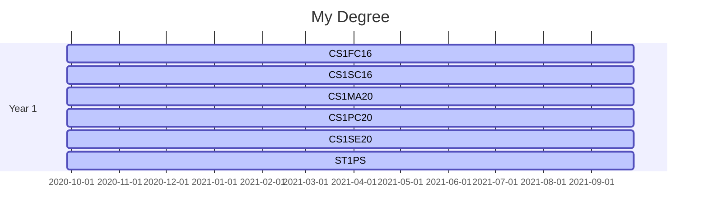

# 29012845 Assignment 2: Models
Module Code: CS1SE20

Assignment report Title: Models Report

Student Number: 29012845

Date:

Actual hrs spent for the assignment:

Assignment evaluation (3 key points): 

## Abstract

## Introduction

## Background

## Work Breakdown Structure

## Gantt for My Studies

## CV
### Joshua Helman

#### About Me
I am a hard-working individual. I am a very resilient, calm and understanding person, wanting to explore my opportinities in the world of work. I have experience with children and adults alike, which allows me to communicate well with all age groups.

#### Skills
* Excellent patience
* Dependable
* Great time management
* Communication
* Taking responsibility

#### Education
**Garth Hill College - Secondary Education** - 2013 to 2018

*Garth Hill College - Bracknell*
I was studying my GCSEs from 2016-2019 and I achieved the following grades:
* English Language- 5
* English Literature- 4
* Mathematics - 6
* Combined Science - 5/5
* Computer Science - 5
* Citizenship - 4

**Garth Hill College - Sixth Form**, 2018-2020

*Garth Hill College, Bracknell*

I achieved the following in my A-Levels:
* A-Level Mathematics - B
* A-Level Computer Science - A
* Level 3 BTEC Engineering - D*

**University of Reading**, 2020-2024

*University of Reading, Reading*
* I am currently studying for a degree in Computer Science

#### Work/Experience
**Ascot Heath Infant School**, 2017-2017, Work Experience as a teaching assistant

*Ascot Heath Infant School, Ascot*
* Worked with children aged 4-6
* I helped the children with their tasks set by the teaching staff, and helped the staff with their lessons
* This was my first taste of the working world and I discovered that my aspiration is to become a teacher. From working here, I was able to build upon my leadership and teamworking skills. I learnt how to take my roll of authority responsibly, and made sure that the children were safe, and that the teachers have everything they needed to complete their lessons and activities, so they went smoothly for the children.

**St. Joseph’s Catholic Primary School**, 2018-2019, Work Experience as a teaching assistant

*St. Joseph’s Catholic Primary School, Bracknell*
* Worked with children aged 4-11
* My tasks were to help the teachers with anything they needed, such as making lesson preperations and helping the children with their work. 
* My work experience took place on one day a week from winter 2018 to summer 2019. I was given the opportunity to work with a the reception class during the first few weeks, where I helped the teachers keep the children safe during their breaks, and helped them deliver Maths and English lessons in which the topics of shapes and phonics were taught respectivly.
* I also helped in the year 6 class where I was given the opportunity to deliver one of their Science lessons and teach them about electricity through several activities where the teacher supervised me and made sure I delivered the lesson correctly.
* During my time here, I developed my time-managment skills and communication through my work delivering lessons and making sure I covered what need to be.

**Garth Hill College**, 2019-2019, Work Experience as a teaching assistant

*Garth Hill College, Bracknell*
* I worked with children ages 11-15
* I observed lessons from teachers in the Maths and Computer Science department and helped the students during their lesson, asnwering questions and helping them to userstand the material
* I had the opportinity to teach a GCSE Computer Science lesson to a class of Year 9 students.
* This was my favourite experience in the working world. I developed my communication skills through teaching lessons and helping students understand their work. This was a valuable experience in my life as it gave me lots of experience working with a range of people all with similar interests as myself. 

**Doors and Fittings LTD**, 2018-present, Working in Technical Support

*Doors and Fittings LTD, Bracknell*
* My duties are to assist the director of the company with their tasks which usually include writing emails to customers and the website developers at Etail Systems, improving the website by adding new product and fixing errors on existing item listings using the development companies tools, gathering information on new prducts, and phone conversations with developers to establish good communication with them.
* This job has been invaluable to me in improving my worth ethic, time managment, communication and research skills. Through this job, I have significantly improved my writing skills too, as it is imperative I communicate my views on matters relating to the website accuratly and so that there is no confusion, and hence, work is completed on time and correctly. Otherwise, it is my fault if something goes wrong, so I need to be responsible and clear. I like learning how websites are made and developing my understanding of the Internet.

## Reflection
I have chosen to use markdown syntax to produce my Work Breakdown Structure and Gantt graph for many reasons instead of using other applications like Microsoft Visio:
* It has easy to follow syntax and understand
* I can zoom into the graphs as much as I want. This allows we to use as much detail and have as many boxes as I need and not have to worry about making to readable by making the font size larger or having to create a very long and complex flowchart.
* Markdown will do the formatting for me, which allows me to focus on the content in the charts, rather than the charts themselves and making them presentable
